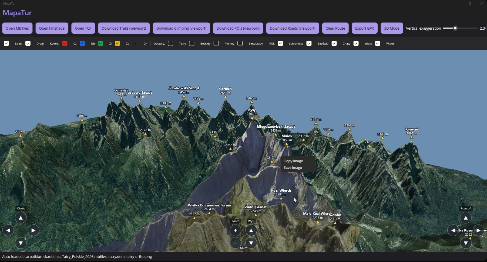

# MapaTur

**Offline-first hiking & tourist map for the Polish Tatras — with a real-time 3D terrain engine — built on .NET MAUI.**

[](https://github.com/Jakub-Syrek/MapaTur2/actions/workflows/ci.yml)
[](https://dotnet.microsoft.com/)
[](https://learn.microsoft.com/dotnet/maui/)
[](docs/3d-terrain.md)
[](https://mapsui.com/)
[](#testing)
[](#architecture)
[](#)
[](#)
[](https://github.com/Jakub-Syrek/MapaTur2/commits)
[](#license)



*Real-time 3D terrain: a high-resolution PL + SK orthophoto draped over the Copernicus DEM, with named summits, depth-occluded hiking trails and roads, and per-pixel lighting.*

## About

MapaTur is a hiking-trip companion for the Tatra mountains that **runs entirely offline**. Drop in any
raster MBTiles archive, import a Garmin TCX track, download OSM hiking trails ahead of your trip, tap two
points on the map, and the app plans an **A\*-optimal route** along marked PTTK trails — then exports it as
GPX for any GPS device.

Its standout feature is an **interactive 3D terrain view**: a from-scratch **OpenGL ES 3.0** renderer
(ANGLE → Direct3D 11 on Windows) draws a Copernicus ~30 m DEM with a real depth buffer, **per-pixel
lighting** and **MSAA**, optionally draped with a **high-resolution orthophoto** (Polish + Slovak imagery
composited across the border). Hiking trails, roads and the planned route are draped and depth-occluded by
the ridges; named summits and mountain POIs are labelled. No telemetry, no accounts, no ads.

## Features

| Feature | Status | Notes |
|---|---|---|
| Offline raster MBTiles rendering | ✅ Verified | Tested with [Compass Kraków Tatry Polskie](https://compass.krakow.pl/) and synthetic demo tiles |
| TCX track import (Garmin v2 schema) | ✅ Verified | Parses Position / AltitudeMeters / HeartRateBpm; skips paused points |
| OSM hiking trail download (Overpass API) | ✅ Verified | Viewport-aware bbox query; persists to local SQLite |
| PTTK color rendering (red/blue/green/yellow/black) | ✅ Verified | Parsed from `osmc:symbol` tag |
| Tap-to-plan A\* routing | ✅ Verified | Distance and Tobler-time cost profiles, pluggable via `IEdgeCostFunction` |
| Elevation profile aggregation | ✅ Verified | Min/max/ascent/descent from track points |
| GPX 1.1 export | ✅ Verified | Invariant-culture coords, elevation when present |
| Localization (PL/EN) | ✅ Verified | Auto-detects from `CultureInfo.CurrentUICulture` |
| Accessibility (semantic labels, AA contrast) | ✅ Verified | Screen-reader hints on toolbar; heading level on status |
| **Interactive 3D terrain (GPU)** | ✅ Verified | OpenGL ES 3.0 / ANGLE renderer, 24-bit depth buffer; orbit / look-around / pan, mouse + keyboard + on-screen pads — see [`docs/3d-terrain.md`](docs/3d-terrain.md) |
| High-resolution DEM terrain mesh | ✅ Verified | Copernicus GLO-30 (~30 m), tiled to beat the 16-bit index limit; hypsometric ramp + Lambert hillshade + vertical exaggeration |
| Depth-occluded 3D trail & route overlays | ✅ Verified | Screen-space ribbon lines, hidden behind ridges, clipped to the DEM edge |
| Named summit overlay | ✅ Verified | DEM peak detection + WGS84 gazetteer (incl. Orla Perć), published elevations, label de-collision |
| Mountain POIs (huts / shelters / chalets / viewpoints) | ✅ Verified | Overpass download; colour-coded markers + labels on 2D map and 3D view (viewpoints as a lookout-tower glyph); per-kind show/hide filter |
| Orthophoto terrain drape | ✅ Verified | Aerial imagery sampled per-pixel over the DEM — GUGiK Geoportal (PL) + ÚGKK ZBGIS (SK) composited cross-border; mipmaps + anisotropic filtering |
| Road overlay (OSM highways) | ✅ Verified | Viewport Overpass download; grey depth-tested ribbons in 3D + 2D layer, independent show/hide |
| Hillshade base layer | ✅ Verified | Multi-layer MBTiles loader + Copernicus hillshade pipeline |
| Elevation-aware routing (SRTM) | ⏳ Planned | Currently routes are flat (Overpass geometry lacks `ele`) |
| Off-trail edges in graph | ⏳ Planned | Cost penalty exists; UI tagging gesture pending |
| GPS dot / live location | ⏳ Planned | Cross-platform location permission story |
| Signed store builds (Play / App Store / MSIX) | ⏳ Pending | Requires signing credentials |

## 3D terrain (GPU engine)

The 3D view is a **custom real-time renderer**, not an off-the-shelf 3D engine:

- **OpenGL ES 3.0 on the SkiaSharp `SKGLView` context** — on Windows ANGLE translates GLES → Direct3D 11; the same path runs natively on Android/iOS.
- **24-bit depth buffer** for hardware occlusion — no painter's algorithm, correct from any angle, full DEM resolution.
- **Tiled mesh** (≤65 536-vertex tiles) built from a Copernicus GLO-30 (~30 m) DEM, with adjustable vertical exaggeration.
- **Per-pixel lighting** (Lambert shading evaluated per fragment from interpolated normals) and **4× MSAA** for smooth slopes and ridgelines.
- **Orthophoto drape** (optional): a high-resolution aerial image sampled per-pixel over the terrain, with mipmaps + anisotropic filtering; falls back to a hypsometric ramp + hillshade when no image is bundled.
- **Trails, roads & route as depth-tested screen-space ribbons** (occluded by ridges, clipped to the DEM); **named summits and mountain POIs** with de-cluttered labels (2D overlay drawn by Skia over the GL terrain).
- Camera: orbit / look-around-in-place / pan / zoom via mouse, keyboard and on-screen pads; **auto-falls-back to a Skia software renderer** on any GL failure, so the view never breaks.

Full write-up: [`docs/3d-terrain.md`](docs/3d-terrain.md).

## Architecture

Clean Architecture with five projects + five matching test projects:

```
src/
├── MapaTur.Domain          GeoPoint, Trail, Track, Route, ElevationProfile, DemRaster, MountainPoi, …
├── MapaTur.Application     use cases + ports + 3D terrain math (Camera3D, TerrainMesh3D, projections)
├── MapaTur.Infrastructure  SQLite, HTTP (Overpass), TCX parser, GPX writer, DEM reader
├── MapaTur.Routing         TrailGraph, AStarRouter, Tobler hiking function
└── MapaTur.App             MAUI: MapPage + view model, OpenGL ES terrain renderer, DI bootstrap
tests/                      400+ unit + integration tests (xUnit + FluentAssertions + FsCheck)
testdata/                   sample-tatry.tcx, overpass-tatry-sample.json, demo MBTiles, DEM generators
docs/
├── adr/                    architecture decision records (MADR format)
├── 3d-terrain.md           3D GPU renderer overview
├── ROADMAP.md              milestone-tracked feature plan
└── PRIVACY.md              what runs locally vs. on network
```

Dependency direction is inward only: `App → Application → Domain`, `Infrastructure → Application → Domain`, `Routing → Domain`. See [`docs/adr/0001-clean-architecture.md`](docs/adr/0001-clean-architecture.md).

## Technology

| Concern | Choice | Rationale |
|---|---|---|
| UI framework | .NET MAUI (.NET 10) | One codebase across Android / iOS / Windows / macOS |
| 2D map rendering | [Mapsui](https://mapsui.com/) + BruTile | Cross-platform 2D map, SkiaSharp-backed |
| 3D terrain rendering | Custom OpenGL ES 3.0 renderer ([Silk.NET](https://github.com/dotnet/Silk.NET) bindings, ANGLE/D3D11) on `SKGLView` | GPU depth buffer + shaders; Skia stays for 2D overlays |
| Elevation data | Copernicus DEM GLO-30 (~30 m) → custom `.dem` binary | Tiled terrain mesh, generated offline by a Python script |
| Geometry | NetTopologySuite | Industry-standard topology operations |
| Storage | SQLite (Microsoft.Data.Sqlite + BruTile.MbTiles) | Embedded, file-based, no server |
| Routing | Custom A\* with pluggable cost functions | Tobler hiking function for hiker-accurate ETA |
| MVVM | CommunityToolkit.Mvvm source generators | `[ObservableProperty]`, `[RelayCommand]` |
| DI | Microsoft.Extensions.DependencyInjection | Built into MAUI |
| Logging | Serilog | Rolling file sink, exe-relative path |
| Tests | xUnit + FluentAssertions + NSubstitute + FsCheck | Property-based tests for parser/router |

See [`docs/adr/0002-tech-stack.md`](docs/adr/0002-tech-stack.md) for alternatives considered.

## Quick start

### Prerequisites

- .NET 10 SDK
- MAUI workload: `dotnet workload install maui` (or `maui-windows maui-android` for selective)
- A raster MBTiles archive for your region of interest

### Build & run

```bash
# Restore + build + test
dotnet build
dotnet test

# Run the Windows desktop variant
dotnet build src/MapaTur.App/MapaTur.App.csproj -f net10.0-windows10.0.19041.0
./src/MapaTur.App/bin/Debug/net10.0-windows10.0.19041.0/win-x64/MapaTur.App.exe
```

### First-run walkthrough

1. **Wczytaj MBTiles** (Open MBTiles) → pick a `.mbtiles` raster archive. The map zooms to its extent.
2. **Pobierz szlaki (widok)** (Download Trails) → fetches OSM hiking relations intersecting the visible bbox via Overpass; renders them in PTTK colors and stores them in `<exe>/data/mapatur-trails.db`.
3. Tap the map twice to set origin and destination — the A\* router computes a route over the trail graph; status shows distance / ascent / ETA.
4. **Eksportuj GPX** (Export GPX) → writes a GPX 1.1 file to `<exe>/exports/mapatur-route-YYYYMMDD-HHMMSS.gpx`.
5. **Wczytaj TCX** (Open TCX) → render a previously recorded Garmin track on the same map.

A synthetic demo MBTiles archive lives at [`testdata/maps/tatry-demo.mbtiles`](testdata/maps/) — generated by [`generate-tatry-demo.py`](testdata/maps/generate-tatry-demo.py) if you need to regenerate.

### Where to source real MBTiles

- [Compass Kraków](https://compass.krakow.pl/) — paid raster archives for Polish hiking regions (verified compatible)
- [MapTiler](https://www.maptiler.com/data/) — global vector + raster downloads (raster only for MapaTur)
- Build your own from Geofabrik PBF + tilemaker — full offline control

Vector MBTiles (PBF tile payloads) are not supported; MapaTur consumes raster PNG/JPG tiles only.

## Localization

UI strings are sourced from `Resources/Localization/AppResources.resx` (English, default) and `AppResources.pl.resx` (Polish). The host OS culture decides which loads at startup. Adding a language: create `AppResources.<culture>.resx` and add the matching keys.

## Privacy

MapaTur sends no telemetry, has no analytics, no user accounts, no advertising. The only outbound network request is the Overpass trail download you explicitly trigger. Full policy in [`docs/PRIVACY.md`](docs/PRIVACY.md).

## Testing

```bash
dotnet test
```

| Suite | Tests | Focus |
|---|---|---|
| `MapaTur.Domain.Tests` | 117 | Value objects, aggregates (Route), elevation math, DEM, POI tags + colours |
| `MapaTur.Application.Tests` | 272 | Overpass queries (trails/POI/roads), 3D terrain math, route planner + use cases |
| `MapaTur.Infrastructure.Tests` | 60 | TCX/Overpass/POI/road parsers, MBTiles + DEM readers, SQLite, GPX |
| `MapaTur.Routing.Tests` | 22 | Tobler function, distance/time cost functions, graph snapping, A\* correctness |
| **Total** | **471** | xUnit + FluentAssertions + NSubstitute + FsCheck |

## Roadmap

Milestones tracked in [`docs/ROADMAP.md`](docs/ROADMAP.md). Initial milestones (M0–M6), hillshade (M7), climbing POIs (M8) and the **3D terrain GPU engine (M9)** are complete and verified live on real Tatra data. Active line of work: mountain POIs (huts/shelters/viewpoints + chains) in 3D, pre-bundled offline trail dataset, and 3D render polish (per-pixel lighting, ortho-imagery draping).

## Contributing

Issues and pull requests are welcome at [github.com/Jakub-Syrek/MapaTur](https://github.com/Jakub-Syrek/MapaTur). Style and quality requirements:

- English-only code, comments, and commit messages
- Conventional Commits (`feat:`, `fix:`, `perf:`, `refactor:`, `test:`, `docs:`, `chore:`)
- JSDoc-style XML doc comments on every public member
- SOLID + Clean Architecture dependency direction respected
- Tests for every behaviour change; no `TreatWarningsAsErrors=false`
- Analyzer noise resolved (NetAnalyzers + Roslynator both enabled at `latest-recommended`)

## Acknowledgments

- [OpenStreetMap](https://www.openstreetmap.org/) contributors — trail & POI data
- [Overpass API](https://overpass-api.de/) — OSM query endpoint
- [Copernicus DEM GLO-30](https://spacedata.copernicus.eu/) (ESA / AWS Open Data) — elevation model for the 3D terrain
- [Mapsui](https://mapsui.com/) — 2D map rendering library
- [SkiaSharp](https://github.com/mono/SkiaSharp) — graphics backend + GL surface host
- [Silk.NET](https://github.com/dotnet/Silk.NET) — OpenGL ES bindings; [ANGLE](https://github.com/google/angle) — GLES→Direct3D translation
- [Compass Kraków](https://compass.krakow.pl/) — Polish Tatry raster MBTiles tested against
- PTTK — Polish Tourist and Sightseeing Society, originators of the red/blue/green/yellow/black trail-marking convention

## License

Copyright (c) Jakub Syrek. All rights reserved.
