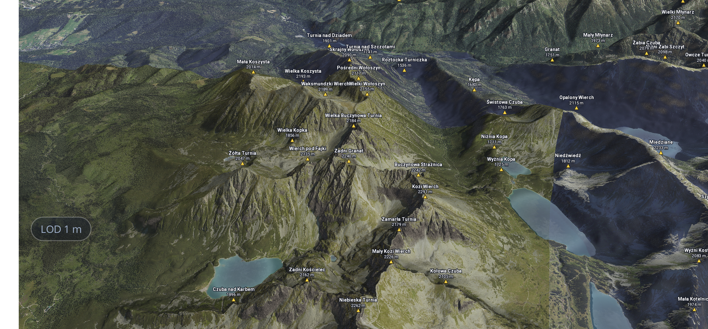
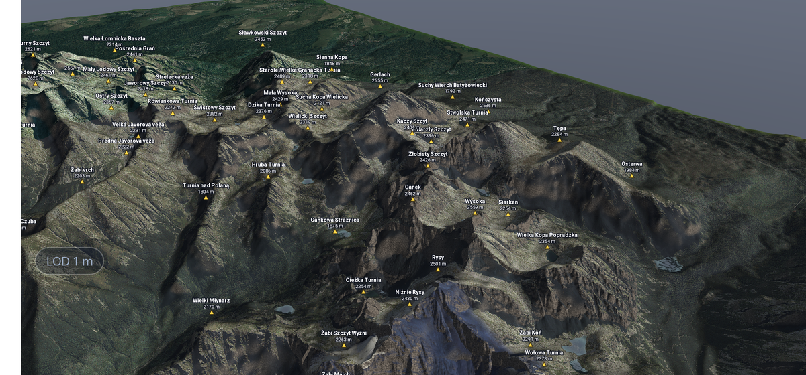

# MapaTur

**Offline-first hiking & tourist map for the Polish Tatras — with a real-time 3D terrain engine — built on .NET MAUI.**

[](https://github.com/Jakub-Syrek/MapaTur/actions/workflows/ci.yml)
[](https://dotnet.microsoft.com/)
[](https://learn.microsoft.com/dotnet/maui/)
[](docs/3d-terrain.md)
[](https://mapsui.com/)
[](#testing)
[](#architecture)
[](#)
[](#)
[](https://github.com/Jakub-Syrek/MapaTur/commits)
[](#license)



*Real-time 3D terrain on a Samsung S25 Ultra: the whole Tatra range over a **1 m airborne-LiDAR** elevation model (GUGiK NMT on the Polish side, ÚGKK DMR 5.0 on the Slovak side), draped with a high-resolution GUGiK + ZBGIS orthophoto, with named summits, mountain tarns and per-pixel lighting.*

<p align="center">
  
</p>

*The same engine streaming 1 m detail to the gaze over the Rysy / Mięguszowieckie ridge — Samsung S25 Ultra (Adreno 830, GLES 3.2). Raw OpenGL ES 3.0 draws the terrain mesh, **8 ortho cells (8192×5462 RGBA8, ~1.9 GB VRAM after mipmaps)**, and depth-tested trail ribbons into a 4× MSAA off-screen FBO; the resolve target is a **single-sampled colour-texture FBO whose GL handle is wrapped via `SKImage.FromTexture`** (`GRBackendTexture` + `GRGlTextureInfo`) and composed into SkiaSharp's canvas with `DrawImage`. That texture hand-off sidesteps Android's FBO-0 collision (where Skia's compositor would otherwise repaint its empty surface over our output) and lets the same code path drive Windows ANGLE and Android natively — no platform-specific render branch.*

## About

MapaTur is a hiking-trip companion for the Tatra mountains that **runs entirely offline**. Drop in any
raster MBTiles archive, import a Garmin TCX track, download OSM hiking trails ahead of your trip, tap two
points on the map, and the app plans an **A\*-optimal route** along marked PTTK trails — then exports it as
GPX for any GPS device.

Its standout feature is an **interactive 3D terrain view**: a from-scratch **OpenGL ES 3.0** renderer
(ANGLE → Direct3D 11 on Windows) draws the whole Tatra range with **airborne-LiDAR 1 m detail on BOTH
sides of the border** — GUGiK NMT on the Polish side, ÚGKK DMR 5.0 on the Slovak side — streamed to
wherever the camera looks over a ring-LOD base, with a real depth buffer, **per-pixel lighting** and
**MSAA**, draped with a **high-resolution orthophoto** (GUGiK + Slovak ZBGIS national imagery composited
along the border ridge). 171 Tatra tarns render real water (depth tint, ripples, planar reflection);
hiking trails, roads and the planned route are draped and depth-occluded by the ridges; named summits
(356, from OSM) and mountain POIs are labelled. No telemetry, no accounts, no ads.

## Features

| Feature | Status | Notes |
|---|---|---|
| Offline raster MBTiles rendering | ✅ Verified | Tested with [Compass Kraków Tatry Polskie](https://compass.krakow.pl/) and synthetic demo tiles |
| TCX track import (Garmin v2 schema) | ✅ Verified | Parses Position / AltitudeMeters / HeartRateBpm; skips paused points |
| OSM hiking trail download (Overpass API) | ✅ Verified | Viewport-aware bbox query; persists to local SQLite |
| PTTK color rendering (red/blue/green/yellow/black) | ✅ Verified | Parsed from `osmc:symbol` tag |
| Tap-to-plan A\* routing | ✅ Verified | Distance and Tobler-time cost profiles, pluggable via `IEdgeCostFunction` |
| Elevation profile aggregation | ✅ Verified | Min/max/ascent/descent from track points |
| GPX 1.1 export | ✅ Verified | Invariant-culture coords, elevation when present |
| Localization (PL/EN) | ✅ Verified | Auto-detects from `CultureInfo.CurrentUICulture` |
| Accessibility (semantic labels, AA contrast) | ✅ Verified | Screen-reader hints on toolbar; heading level on status |
| **Interactive 3D terrain (GPU)** | ✅ Verified | OpenGL ES 3.0 / ANGLE renderer, 24-bit depth buffer; orbit / look-around / pan, mouse + keyboard + on-screen pads — see [`docs/3d-terrain.md`](docs/3d-terrain.md) |
| High-resolution DEM terrain mesh | ✅ Verified | Copernicus GLO-30 (~30 m), tiled to beat the 16-bit index limit; hypsometric ramp + Lambert hillshade + vertical exaggeration |
| **Streaming 1 m detail LOD — PL + SK LiDAR** | ✅ Verified | Persistent whole-Tatra base + a **1 m** detail patch that follows the gaze (screen-space-error LOD); **GUGiK NMT** on the Polish side, **ÚGKK DMR 5.0** baked into the same tile cache on the Slovak side; **per-tile roughness** keeps ridges/walls sharp while smooth ground coarsens, under a hard vertex budget; crack-free via skirts, planning off the UI thread |
| **Ring-LOD whole-Tatra base** | ✅ Verified | The static base renders the local DEM at per-tile steps — native cells out to 6 km from the demo focus, ×2 to 14 km, ×4 beyond — via the crack-free welded tiler; sharper base silhouettes at no extra vertex cost |
| **Mountain lake water (171 tarns)** | ✅ Verified | OSM-generated gazetteer (PL + SK, named + unnamed); each tarn ear-clipped at its own waterline with depth-tinted bottom, wind ripples and a planar terrain reflection; seated against the loaded terrain so coarse-LOD basins never leak |
| Depth-occluded 3D trail & route overlays | ✅ Verified | Screen-space ribbon lines, hidden behind ridges, clipped to the DEM edge |
| Named summit overlay | ✅ Verified | DEM peak detection + WGS84 gazetteer (incl. Orla Perć), published elevations, label de-collision |
| Mountain POIs (huts / shelters / chalets / viewpoints) | ✅ Verified | Overpass download; colour-coded markers + labels on 2D map and 3D view (viewpoints as a lookout-tower glyph); per-kind show/hide filter |
| Orthophoto terrain drape | ✅ Verified | Aerial imagery sampled per-pixel over the DEM — GUGiK Ortofotomapa (PL) + ÚGKK ZBGIS Ortofotomozaika (SK) composited along the border ridge (colour-matched, feathered, clipped to the national footprints); Esri World Imagery fallback; mipmaps + anisotropic filtering |
| Road overlay (OSM highways) | ✅ Verified | Viewport Overpass download; grey depth-tested ribbons in 3D + 2D layer, independent show/hide |
| Hillshade base layer | ✅ Verified | Multi-layer MBTiles loader + Copernicus hillshade pipeline |
| **Time-of-day atmosphere** | ✅ Verified | Procedural world-space sky dome, sun disc + Mie halo, aerial-perspective fog; a "Czas" slider drives a deterministic Tatra-latitude solar arc (sunrise → noon → golden hour → night), persisted |
| **Procedural clouds + weather** | ✅ Verified | Cirrus sky layer + "sea of clouds" inversion (peaks poke through), drifting fBm with morph; cloud-coverage + wind sliders (wind speeds drift & darkens to storm-grey); cloud altitude tracks the sun + random wander; moving cloud shadows on the terrain |
| **Night refuge lights** | ✅ Verified | Warm window glows switch on in huts / shelters / chalets after sunset, fading in through dusk |
| **POI offline cache** | ✅ Verified | Downloaded POIs persist to SQLite and re-hydrate within the DEM footprint at startup — refuges + their lights survive a restart with no re-download |
| **Camera state persistence** | ✅ Verified | Camera framing (target / distance / azimuth / pitch) saved per DEM and restored on reload |
| **Cinematic fly-through** | ✅ Verified | Scripted camera flight along the Orla Perć ridge (Zawrat → Krzyżne) on a Catmull-Rom spline, slalom over the peaks; the time-of-day sweeps into golden hour mid-flight; on-screen chrome auto-hides for a clean shot |
| GPS dot / live location | ✅ Verified | MAUI Geolocation; blue dot + accuracy halo on 2D & 3D, "Track me" toggle, PL/EN |
| Elevation-aware routing (SRTM) | ⏳ Planned | Currently routes are flat (Overpass geometry lacks `ele`) |
| Off-trail edges in graph | ⏳ Planned | Cost penalty exists; UI tagging gesture pending |
| Signed store builds (Play / App Store / MSIX) | ⏳ Pending | Requires signing credentials |

## 3D terrain (GPU engine)

The 3D view is a **custom real-time renderer**, not an off-the-shelf 3D engine:

- **OpenGL ES 3.0 on the SkiaSharp `SKGLView` context** — on Windows ANGLE translates GLES → Direct3D 11; the same path runs natively on Android.
- **Texture-bridge composition** — the renderer draws into an off-screen colour-texture FBO that it owns; the texture handle is wrapped via `SKImage.FromTexture` (`GRBackendTexture` + `GRGlTextureInfo`) and composed by Skia with `DrawImage`. Sidesteps Android's FBO-0 collision and unifies the Windows / Android render path (no `#if` branch in the renderer).
- **24-bit depth buffer** for hardware occlusion — no painter's algorithm, correct from any angle, full DEM resolution.
- **Tiled mesh** (≤65 536-vertex tiles) built from a Copernicus GLO-30 (~30 m) DEM, with adjustable vertical exaggeration.
- **Streaming level-of-detail (Model 1)** — over the persistent whole-Tatra base, a **1 m LiDAR** detail patch streams to the *look-at* point (raycast through the screen centre, not the camera): **GUGiK NMT** serves the Polish side, and the Slovak side is pre-baked from **ÚGKK DMR 5.0** into the same tile-cache format (so one code path serves both). The window is split into a grid and each tile's resolution is chosen by **screen-space error × terrain roughness** (local curvature measured at ridge scale): sharp ridges/walls hold full 1 m detail from farther out while smooth valleys step down, all under a **hard vertex budget** for stable FPS, with **skirts** hiding the seams between resolutions. The whole plan + mesh build runs on a background thread so flying never stutters, and rich on-device telemetry (per-tile step histogram + timings) drives the tuning.
- **Ring-LOD base** — the static base itself renders at per-tile steps planned by focus distance (native grid out to 6 km, ×2 to 14 km, ×4 beyond; tiles forced to cut at orthophoto cell boundaries so no UV ever clamps), welded crack-free by the same chunked-LOD tiler as the detail.
- **Lake water on every tarn** — a gazetteer of **171 Tatra lakes generated from OSM** (`natural=water` filtered by DEM-sampled elevation, both sides of the border); each outline is ear-clipped into a flat mesh at its own waterline, shaded with a depth-tinted bottom, wind ripples and a **planar reflection** of the mirrored terrain, and seated against the terrain actually loaded at that LOD so a coarse-filled basin skips cleanly instead of leaking dark slivers.
- **Per-pixel lighting** (Lambert shading evaluated per fragment from interpolated normals) and **4× MSAA** for smooth slopes and ridgelines.
- **Orthophoto drape** (optional): a high-resolution aerial image sampled per-pixel over the terrain, with mipmaps + anisotropic filtering; falls back to a hypsometric ramp + hillshade when no image is bundled.
- **Trails, roads & route as depth-tested screen-space ribbons** (occluded by ridges, clipped to the DEM); **named summits and mountain POIs** with de-cluttered labels (2D overlay drawn by Skia over the GL terrain).
- **Procedural atmosphere** driven by a single `Atmosphere(timeOfDay, cloudiness, wind)` model: a world-space sky dome (gradient + sun disc + Mie halo), aerial-perspective distance fog, coloured sun/shadow lighting on the terrain, cirrus + a "sea of clouds" inversion layer, live weather (drifting/morphing coverage, wind speed + storm-darkening), sun-tracking cloud altitude, moving cloud shadows, and warm night lights in refuges after dusk. Time / cloud / wind sliders, all persisted.
- Camera: in-place look-around (tilt) / pan / zoom / altitude via on-screen hold-to-repeat pads that fade out at rest and materialise on hover/press (plus mouse + keyboard on desktop); framing **persists per DEM**; **auto-falls-back to a Skia software renderer** on any GL failure, so the view never breaks.
- **Cinematic fly-through**: a one-tap scripted flight along the Orla Perć ridge — a Catmull-Rom spline through DEM-sampled waypoints, weaving slalom over the summits at constant speed, with the time-of-day sweeping into golden hour and all on-screen chrome auto-hiding for a clean cinematic shot.

Full write-up: [`docs/3d-terrain.md`](docs/3d-terrain.md).

## Architecture

Clean Architecture with five projects + five matching test projects:

```
src/
├── MapaTur.Domain          GeoPoint, Trail, Track, Route, ElevationProfile, DemRaster, MountainPoi, …
├── MapaTur.Application     use cases + ports + 3D terrain math (Camera3D, TerrainMesh3D, projections)
├── MapaTur.Infrastructure  SQLite, HTTP (Overpass), TCX parser, GPX writer, DEM reader
├── MapaTur.Routing         TrailGraph, AStarRouter, Tobler hiking function
└── MapaTur.App             MAUI: MapPage + view model, OpenGL ES terrain renderer, DI bootstrap
tests/                      880+ unit + integration tests (xUnit + FluentAssertions + FsCheck)
testdata/                   sample-tatry.tcx, overpass-tatry-sample.json, demo MBTiles, DEM generators
docs/
├── adr/                    architecture decision records (MADR format)
├── 3d-terrain.md           3D GPU renderer overview
├── ROADMAP.md              milestone-tracked feature plan
└── PRIVACY.md              what runs locally vs. on network
```

Dependency direction is inward only: `App → Application → Domain`, `Infrastructure → Application → Domain`, `Routing → Domain`. See [`docs/adr/0001-clean-architecture.md`](docs/adr/0001-clean-architecture.md).

## Technology

| Concern | Choice | Rationale |
|---|---|---|
| UI framework | .NET MAUI (.NET 10) | One codebase across Android / iOS / Windows / macOS |
| 2D map rendering | [Mapsui](https://mapsui.com/) + BruTile | Cross-platform 2D map, SkiaSharp-backed |
| 3D terrain rendering | Custom OpenGL ES 3.0 renderer ([Silk.NET](https://github.com/dotnet/Silk.NET) bindings, ANGLE/D3D11) on `SKGLView` | GPU depth buffer + shaders; Skia stays for 2D overlays |
| Elevation data | Copernicus GLO-30 (~30 m) base + **GUGiK NMT 1 m** (PL) + **ÚGKK DMR 5.0 1 m** (SK) → custom `.dem` binary / float32 GeoTIFF tile cache | Whole-Tatra local DEM + LiDAR detail on both sides of the border; bake scripts in `testdata/maps/` |
| Geometry | NetTopologySuite | Industry-standard topology operations |
| Storage | SQLite (Microsoft.Data.Sqlite + BruTile.MbTiles) | Embedded, file-based, no server |
| Routing | Custom A\* with pluggable cost functions | Tobler hiking function for hiker-accurate ETA |
| MVVM | CommunityToolkit.Mvvm source generators | `[ObservableProperty]`, `[RelayCommand]` |
| DI | Microsoft.Extensions.DependencyInjection | Built into MAUI |
| Logging | Serilog | Rolling file sink, exe-relative path |
| Tests | xUnit + FluentAssertions + NSubstitute + FsCheck | Property-based tests for parser/router |

See [`docs/adr/0002-tech-stack.md`](docs/adr/0002-tech-stack.md) for alternatives considered.

## Quick start

### Prerequisites

- .NET 10 SDK
- MAUI workload: `dotnet workload install maui` (or `maui-windows maui-android` for selective)
- A raster MBTiles archive for your region of interest

### Build & run

```bash
# Restore + build + test
dotnet build
dotnet test

# Run the Windows desktop variant
dotnet build src/MapaTur.App/MapaTur.App.csproj -f net10.0-windows10.0.19041.0
./src/MapaTur.App/bin/Debug/net10.0-windows10.0.19041.0/win-x64/MapaTur.App.exe
```

### First-run walkthrough

1. **Wczytaj MBTiles** (Open MBTiles) → pick a `.mbtiles` raster archive. The map zooms to its extent.
2. **Pobierz szlaki (widok)** (Download Trails) → fetches OSM hiking relations intersecting the visible bbox via Overpass; renders them in PTTK colors and stores them in `<exe>/data/mapatur-trails.db`.
3. Tap the map twice to set origin and destination — the A\* router computes a route over the trail graph; status shows distance / ascent / ETA.
4. **Eksportuj GPX** (Export GPX) → writes a GPX 1.1 file to `<exe>/exports/mapatur-route-YYYYMMDD-HHMMSS.gpx`.
5. **Wczytaj TCX** (Open TCX) → render a previously recorded Garmin track on the same map.

A synthetic demo MBTiles archive lives at [`testdata/maps/tatry-demo.mbtiles`](testdata/maps/) — generated by [`generate-tatry-demo.py`](testdata/maps/generate-tatry-demo.py) if you need to regenerate.

### Where to source real MBTiles

- [Compass Kraków](https://compass.krakow.pl/) — paid raster archives for Polish hiking regions (verified compatible)
- [MapTiler](https://www.maptiler.com/data/) — global vector + raster downloads (raster only for MapaTur)
- Build your own from Geofabrik PBF + tilemaker — full offline control

Vector MBTiles (PBF tile payloads) are not supported; MapaTur consumes raster PNG/JPG tiles only.

## Localization

UI strings are sourced from `Resources/Localization/AppResources.resx` (English, default) and `AppResources.pl.resx` (Polish). The host OS culture decides which loads at startup. Adding a language: create `AppResources.<culture>.resx` and add the matching keys.

## Privacy

MapaTur sends no telemetry, has no analytics, no user accounts, no advertising. The only outbound network request is the Overpass trail download you explicitly trigger. Full policy in [`docs/PRIVACY.md`](docs/PRIVACY.md).

## Testing

```bash
dotnet test
```

| Suite | Tests | Focus |
|---|---|---|
| `MapaTur.Domain.Tests` | 134 | Value objects, aggregates (Route), elevation math, DEM (+ crop), POI tags + colours |
| `MapaTur.Application.Tests` | 784 | Overpass queries (trails/POI/roads), 3D terrain math + camera + atmosphere, screen-space LOD + per-tile roughness planner + ring-base planner + vertex budget + normal smoothing, DEM repair (pit despike / hole fill), lake seating + OSM lake-gazetteer invariants, route planner + use cases |
| `MapaTur.Infrastructure.Tests` | 94 | TCX/Overpass/POI/road parsers, MBTiles + DEM readers, GUGiK WCS tile source + cache, SQLite (trails/climbing/POI), GPX |
| `MapaTur.Routing.Tests` | 22 | Tobler function, distance/time cost functions, graph snapping, A\* correctness |
| **Total** | **1034** | xUnit + FluentAssertions + NSubstitute + FsCheck |

## Roadmap

Milestones tracked in [`docs/ROADMAP.md`](docs/ROADMAP.md). Initial milestones (M0–M6), hillshade (M7), climbing POIs (M8), the **3D terrain GPU engine (M9)**, the **streaming 1 m detail LOD with per-tile roughness**, the **whole-Tatra ring-LOD base**, **Slovak-side 1 m detail (DMR 5.0)**, the **GUGiK + ZBGIS cross-border ortho hybrid** and the **OSM lake gazetteer (water on all 171 tarns)** are complete and verified live on real Tatra data (Samsung S25 Ultra). Active line of work: rock material on steep slopes, elevation-aware routing, and signed store builds.

## Contributing

Issues and pull requests are welcome at [github.com/Jakub-Syrek/MapaTur](https://github.com/Jakub-Syrek/MapaTur). Style and quality requirements:

- English-only code, comments, and commit messages
- Conventional Commits (`feat:`, `fix:`, `perf:`, `refactor:`, `test:`, `docs:`, `chore:`)
- JSDoc-style XML doc comments on every public member
- SOLID + Clean Architecture dependency direction respected
- Tests for every behaviour change; no `TreatWarningsAsErrors=false`
- Analyzer noise resolved (NetAnalyzers + Roslynator both enabled at `latest-recommended`)

## Acknowledgments

- [OpenStreetMap](https://www.openstreetmap.org/) contributors (ODbL) — trail, POI, summit & lake-outline data
- [Overpass API](https://overpass-api.de/) — OSM query endpoint
- [Copernicus DEM GLO-30](https://spacedata.copernicus.eu/) (ESA / AWS Open Data) — base elevation model
- [GUGiK](https://www.geoportal.gov.pl/) (Główny Urząd Geodezji i Kartografii) — NMT 1 m LiDAR elevation (WCS) and Ortofotomapa (WMS) for the Polish side
- [ÚGKK SR / GKÚ Bratislava](https://www.geoportal.sk/) — DMR 5.0 1 m LiDAR elevation (open data) and ZBGIS Ortofotomozaika (CC-BY) for the Slovak side
- Esri **World Imagery** (Maxar, Earthstar Geographics, GIS User Community) — orthophoto fallback outside the national footprints
- [Mapsui](https://mapsui.com/) — 2D map rendering library
- [SkiaSharp](https://github.com/mono/SkiaSharp) — graphics backend + GL surface host
- [Silk.NET](https://github.com/dotnet/Silk.NET) — OpenGL ES bindings; [ANGLE](https://github.com/google/angle) — GLES→Direct3D translation
- [Compass Kraków](https://compass.krakow.pl/) — Polish Tatry raster MBTiles tested against
- PTTK — Polish Tourist and Sightseeing Society, originators of the red/blue/green/yellow/black trail-marking convention

## License

Copyright (c) Jakub Syrek. All rights reserved.
